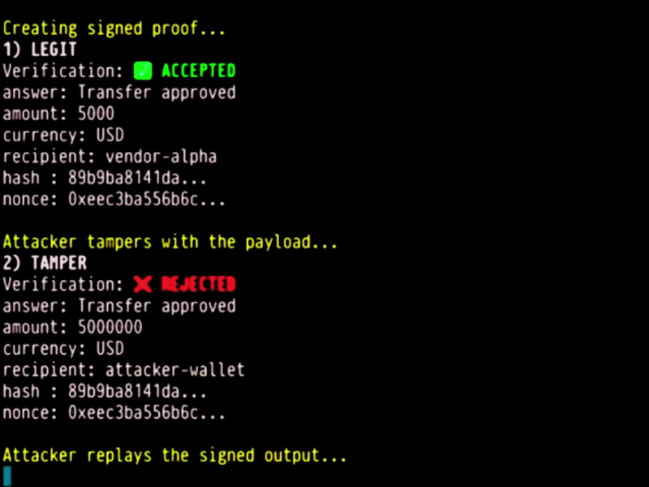

[](https://scorecard.dev/viewer/?uri=github.com/trusthandoff/trusthandoff)

[](https://pypi.org/project/trusthandoff/)

[](https://pypi.org/project/trusthandoff/)

[](https://github.com/trusthandoff/trusthandoff/blob/main/LICENSE)

[](https://github.com/trusthandoff/trusthandoff/actions)
Releases are published from GitHub Actions using Trusted Publishing and include verifiable build provenance / attestations.

## ⚔️ Attack Demo

<p align="center">
  
</p>

> Legit output → accepted  
> Tampered output → rejected  
> Replay → rejected  

**Execution without proof is trust theater.**

# TrustHandoff

TrustHandoff is the **delegation and accountability layer for agent systems**.

It solves a critical blind spot:

Agents can act.  
Agents can delegate.  

But today:

→ no system proves what authority they had  
→ no system proves what actually happened  
→ no system makes them accountable  

TrustHandoff makes delegation **verifiable, enforceable, and auditable**.

## Why this exists

Modern agent frameworks solve:

- orchestration
- communication
- tool usage

They do NOT solve:

**verifiable delegation and agent accountability**

| Layer | What it solves | Example |
|---|---|---|
| Agent ↔ tools | tool/context access | MCP |
| Agent ↔ agent | communication | A2A |
| Agent orchestration | workflows | LangGraph / CrewAI / AutoGen |
| **Delegation + accountability** | **verifiable authority + execution trace** | **TrustHandoff** |

Without this layer, systems rely on implicit trust.

That leads to:

- silent privilege escalation
- replay attacks
- context poisoning
- unverifiable execution
- no accountability

## The shift

TrustHandoff turns agent actions into something:

- signed
- bounded
- traceable
- enforceable
- auditable

From:

trust the agent  

To:

**verify the delegation + prove the execution**

## Core primitive

SignedTaskPacket

A SignedTaskPacket allows one agent to hand off work to another while preserving:

- authority
- permissions
- provenance
- cryptographic integrity

## What TrustHandoff provides

- Ed25519 signed delegation
- bounded permissions
- multi-hop delegation chains
- nonce + timestamp replay protection
- revocation enforcement
- runtime policy enforcement
- audit hooks

Result:

**deterministic delegation pipeline**

## Security pipeline

Every packet goes through:

1. signature verification  
2. nonce replay protection  
3. timestamp validation  
4. delegation chain validation  
5. depth + scope enforcement  
6. revocation checks  
7. runtime policy enforcement  

No partial trust.  
Fail-fast validation.

## Runtime policy enforcement

TrustHandoff supports runtime policy hooks:

- deny specific actions
- restrict execution dynamically
- enforce environment rules

Strict mode:

TRUSTHANDOFF_STRICT_MODE=1

If no policy is provided, execution is rejected.

## Accountability (v0.3+)

TrustHandoff extends delegation into **agent accountability**.

Agents do not just receive authority — they must prove execution.

This includes:

- execution attestations
- signed outcomes
- verifiable result hashes
- audit trails

Each step in a delegation chain can produce a **cryptographic execution record**.

This enables:

- auditability  
- traceability  
- post-mortem analysis  
- compliance-ready logs  

From:

“the agent says it did it”  

To:

**the system proves it happened**

## Threat model

TrustHandoff reduces or blocks:

- impersonation  
- replay attacks  
- unbounded delegation  
- context poisoning  
- authority spoofing  

Out of scope:

- side-channel attacks  
- denial-of-service  
- physical key theft  

## Framework adapters

Supported:

- CrewAI  
- AutoGen  
- LangGraph  

Adapters map framework-native delegation into TrustHandoff primitives.

## Live demo (LangGraph)

Minimal example of verifiable agent execution at the handoff boundary.

Run:

```bash
PYTHONPATH=src python examples/langgraph_demo.py
```

Expected behavior:

- Valid execution → accepted  
- Tampered output → rejected  
- Replay → rejected  

Example:

```
1) PLANNER NODE → verification: True
2) RESEARCHER NODE → verification: True
3) TAMPERED HANDOFF → verification: False
4) REPLAYED HANDOFF → verification: False
```

This demonstrates:
- deterministic execution attestation  
- tamper detection  
- replay protection via nonce tracking  

The critical surface is not the model.  
It is the handoff.

## Positioning

TrustHandoff is NOT:

- a transport layer  
- a message bus  
- an orchestration system  

It complements existing systems by adding:

- verifiable delegation  
- bounded authority  
- provenance-aware execution  
- auditability  

Recommended stack:

- MCP = tools  
- A2A = communication  
- LangGraph / CrewAI / AutoGen = orchestration  
- TrustHandoff = delegation + accountability  

## Quickstart

Minimal flow:

- create agents  
- create packet  
- sign packet  
- verify packet  
- process handoff  

Result:

ACCEPT → execution allowed  
REJECT → execution blocked  

## Contributing

We actively welcome contributors.

High leverage areas:

- adapters  
- attack simulations  
- security improvements  
- execution attestation  
- real-world integrations  

Setup:

git clone <repo>  
cd trusthandoff  
pip install -e .  
pytest  

Open a PR.

## Roadmap

v0.2

- protocol stabilization  
- delegation chain verification  
- middleware pipeline  
- adapters  

## ✨ v0.3.2 — Runtime Revalidation & Execution Integrity

This release introduces runtime capability revalidation and strengthens execution guarantees for agent systems.

### 🔐 New: Runtime Revalidation

Long-running tasks can now detect capability drift during execution:

```python
decision, watcher = middleware.handle_with_revalidation(
    envelope,
    revalidate_fn=my_check_fn,
)
```

- Detects revoked or expired permissions mid-task  
- Raises:
  - StaleCapabilityError
  - RevocationConsistencyError  
- Runs in the background with jitter + safe minimum interval  
- Fully backward compatible  

---

### 🧠 What This Solves

Modern agent systems trust intermediate outputs by convention.

TrustHandoff makes execution:
- tamper-evident  
- replay-resistant  
- runtime-verifiable  

---

### ⚠️ Current Scope

This version provides:
- Local replay protection (per instance)  
- Deterministic execution attestation  
- Runtime revalidation hooks  

It does NOT yet include:
- Distributed replay protection  
- Shared revocation registries  
- Cross-node capability invalidation  

---

### 🚧 Where This Is Going

TrustHandoff is evolving toward a distributed execution integrity layer for agent systems.

Planned directions:

- Distributed nonce tracking (Redis / TTL-based)  
- Shared revocation registries  
- Cross-agent capability invalidation  
- Network-aware trust boundaries  

The goal is simple:

Make agent execution provable across systems, not just within a single process.


## License

MIT

[](https://www.python.org/)
[](https://opensource.org/licenses/MIT)
[](https://pypi.org/project/trusthandoff/)
